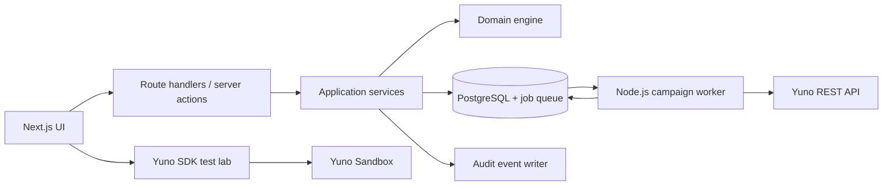
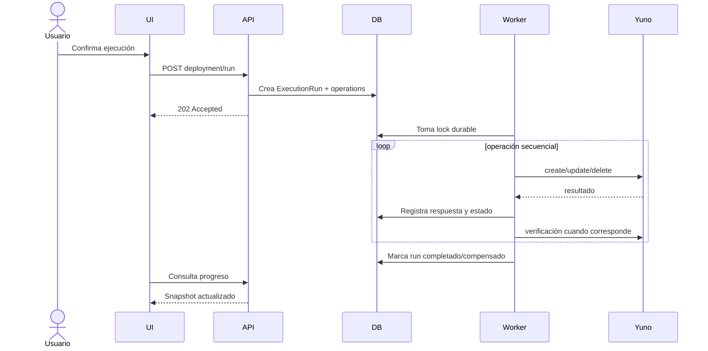

# 05. Arquitectura propuesta

## 1. Estilo arquitectónico

Aplicación modular con Next.js como frontend y BFF, dominio aislado de framework, PostgreSQL como fuente de verdad, Prisma ORM para persistencia y un ejecutor durable para operaciones multi-paso.

PostgreSQL se utilizará también como queue. Los runs y sus operaciones pendientes vivirán en las mismas tablas operativas; un worker Node.js del mismo repositorio los reclamará y procesará. No se incorporarán Redis, RabbitMQ, Kafka ni plataformas externas de workflows en la primera versión.

No se ejecutará una campaña completa dentro del ciclo de vida de un request HTTP. Las operaciones contra Yuno pueden ser largas, fallar parcialmente o requerir reconciliación.



## 2. Capas

### Dominio

TypeScript puro, sin imports de Next, Prisma o SDK.

Responsabilidades:

- rangos y cuotas;
- proyección temporal;
- resolución de prioridades;
- generación de segmentos;
- validaciones e invariantes;
- diff de configuraciones;
- plan de operaciones y compensaciones;
- generación de casos de prueba.

### Aplicación

Coordina casos de uso:

- crear/versionar campaña;
- validar;
- desplegar en sandbox;
- crear ensayo;
- registrar pruebas;
- aprobar;
- desplegar en producción;
- cancelar/reemplazar;
- reconciliar.

### Infraestructura

- repositorios Prisma;
- adapter REST de Yuno;
- autenticación;
- queue PostgreSQL/worker Node.js;
- observabilidad;
- exportaciones.

### Presentación

- páginas Next.js;
- formularios;
- calendario/Gantt;
- SDK lab;
- vistas de ejecución y auditoría.

## 3. Módulos propuestos

```text
src/
  app/
    (authenticated)/
      dashboard/
      calendar/
      campaigns/
      banks/
      templates/
      executions/
      audit/
      admin/
    api/
  modules/
    campaigns/
      domain/
      application/
      infrastructure/
      presentation/
    catalog/
    planning/
    executions/
    testing-lab/
    approvals/
    audit/
    identity/
  shared/
    domain/
    infrastructure/
    ui/
```

Cada módulo expone una API pública interna. Los componentes UI no llaman directamente al adapter de Yuno ni a Prisma.

## 4. Flujo de comandos



## 5. Adaptador de Yuno

Única frontera autorizada para llamadas REST. Debe:

- resolver URL y credenciales por ambiente en servidor;
- validar ambiente y rol;
- transformar DTOs internos;
- normalizar errores y cuerpos vacíos;
- aplicar timeouts;
- redactar secretos en logs;
- entregar respuesta cruda segura para auditoría;
- soportar contract tests.

Las operaciones permitidas inicialmente son las cinco de installment plans. El SDK se integra en un módulo separado exclusivamente de pruebas visuales.

## 6. Ejecutor durable

Requisitos:

- persistencia de cada paso antes y después de llamar a Yuno;
- lease/lock para evitar dos workers sobre el mismo run;
- operaciones secuenciales;
- reanudación tras reinicio;
- compensaciones explícitas;
- clasificación de errores retryable/no retryable/unknown;
- heartbeat y detección de runs abandonados;
- exclusión mutua por ambiente y alcance afectado.

### Implementación acordada

- `ExecutionRun` es el job de la queue.
- `ExecutionOperation` contiene el workflow persistido paso por paso.
- El endpoint web crea el run y todas sus operaciones en una transacción local; no ejecuta la campaña.
- Un único worker inicial consulta PostgreSQL periódicamente y reclama un run de forma atómica.
- El worker utiliza lease y heartbeat para detectar ejecuciones abandonadas.
- Al reiniciar, retoma desde la última operación confirmada.
- El polling simple de PostgreSQL es suficiente para el volumen inicial; no se requiere `LISTEN/NOTIFY` ni tiempo real.
- La UI también usa polling HTTP para mostrar progreso en la primera versión.
- Web y worker comparten código, Prisma, dominio, adapter Yuno y configuración.
- En desarrollo se ejecutan como dos procesos del mismo repositorio.

### Topología acordada

- Next.js: Render Web Service.
- Worker Node.js: Render Background Worker.
- PostgreSQL/queue: Railway PostgreSQL.
- Web y worker: mismo repositorio y commit, con comandos de inicio diferentes.
- Conexión a DB: URL externa de Railway con TLS, porque no existe red privada compartida entre proveedores.
- Región recomendada: Render Virginia y Railway US East, salvo que la base existente obligue a otra combinación cercana.

La latencia de base y el egress cross-cloud deberán medirse en la fase 0. El worker seguirá usando exclusivamente PostgreSQL como queue.

## 7. Fuente de verdad

PostgreSQL contiene:

- catálogo y plantillas;
- campañas y versiones;
- proyección futura;
- IDs remotos por ambiente;
- operaciones y respuestas;
- pruebas y aprobaciones;
- auditoría.

Yuno se consulta para verificar estado real y detectar drift, pero el listado remoto no reemplaza el registro local de futuros.

## 8. Concurrencia

Se aplicarán controles optimistas y locks operativos:

- `version` o timestamp para edición concurrente de borradores;
- campaña inmutable desde el inicio de ejecución;
- lock por `environment + scope` durante una escritura;
- bloqueo de pruebas SDK concurrentes sobre la misma cuenta sandbox;
- idempotency key local por comando/run.

## 9. Configuración y secretos

- Variables privadas solo en servidor.
- Validación estricta de configuración al iniciar.
- Credenciales separadas por ambiente.
- Ninguna selección de ambiente se acepta sin autorización server-side.
- Rotación sin cambios de código.
- Redacción automática de headers y tokens.

## 10. Decisiones técnicas diferidas

- Proveedor de identidad.
- Librería de calendario/Gantt.
- Almacenamiento de evidencias visuales si se requieren capturas.

Se resolverán en la fase de arquitectura ejecutable mediante ADRs.
