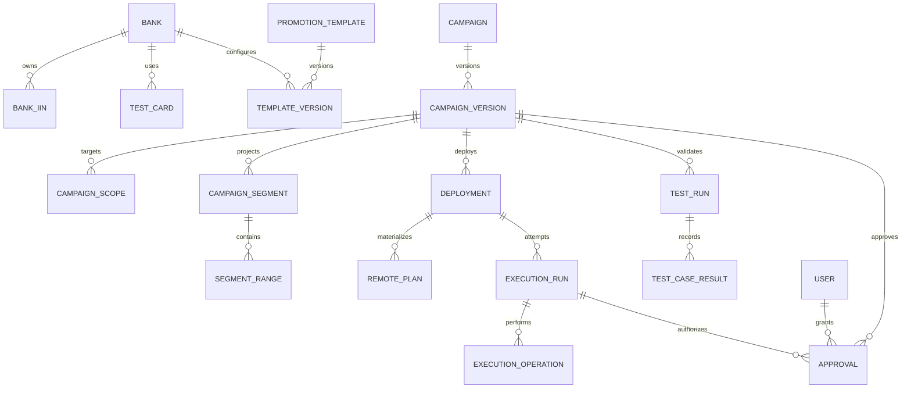

# 06. Modelo de datos con PostgreSQL y Prisma

## 1. Objetivos

- Representar intención comercial y planes remotos por separado.
- Versionar todo dato que afecte ejecución.
- Conservar IDs futuros invisibles para `get all`.
- Relacionar sandbox y producción sin compartir IDs.
- Auditar cada transición.
- Permitir consultas temporales y calendario.

## 2. Diagrama conceptual

## 3. Catálogo

### Estado implementado

El esquema Prisma y la migración versionada ya incluyen `Bank`, `BankIin`, `PromotionTemplate` y `TemplateVersion`. También se agregó `CampaignVersion.sourceTemplateVersionId` para conservar el origen de una campaña. La migración del catálogo todavía debe aplicarse en la PostgreSQL remota de pruebas.

La primera iteración implementa únicamente scopes `GENERAL` y `BANK`. `TestCard`, Amex y otros scopes especiales permanecen como diseño pendiente, no como tablas o enums disponibles hoy.

### `Bank`

- `id`
- `code` único
- `name`
- `description`
- `status`: `ACTIVE | INACTIVE | ARCHIVED`
- `createdAt`, `updatedAt`

General y Amex pueden modelarse como scopes especiales; Amex puede tener una entidad de catálogo propia si facilita BINs y tarjetas.

### `BankIin`

- `id`
- `bankId`
- `value` normalizado
- `activeFrom`, `activeTo`
- `status`: `ACTIVE | INACTIVE`
- `createdAt`, `updatedAt`

La aplicación valida valores numéricos de 6 a 8 dígitos. Un índice único parcial de PostgreSQL garantiza que un BIN/IIN activo pertenezca a un solo banco y permite conservar registros inactivos como historia.

### `TestCard`

- `id`
- `bankId` opcional para General
- `label`
- `numberEncrypted` o tratamiento definido para datos de prueba
- `iin`
- `active`

Aunque sean tarjetas de QA, la UI evitará exposición innecesaria y distinguirá claramente datos de prueba.

### `PromotionTemplate` y `TemplateVersion`

La entidad estable contiene nombre, scope, estado y referencia a versión actual. La implementación actual soporta `GENERAL | BANK`. Cada versión contiene:

- referencia opcional al banco;
- hash canónico y motivo del cambio;
- snapshot JSON validado de cuatro rangos ARS;
- cuotas por rango;
- usuario creador y número de versión.

La primera versión se crea de forma transaccional junto con la plantilla. La creación de versiones posteriores y la desactivación sin efectos remotos están pendientes.

## 4. Campañas

### `Campaign`

- `id`
- `name`
- `description`
- `createdById`
- `currentVersionId`
- timestamps

El estado operativo mostrado para una campaña se deriva de sus versiones, deployments y runs; no se persiste como una máquina de estados única.

### `CampaignVersion`

- `id`
- `campaignId`
- `versionNumber`
- `canonicalHash`
- `status`: `DRAFT | VALIDATED | SUPERSEDED`
- `sourceTemplateVersionId` nullable
- `changeReason`
- `configurationSnapshot` JSON tipado/validado
- `createdById`
- `createdAt`
- `supersededAt`

Una versión probada no se edita.

### `CampaignScope`

- tipo: `GENERAL | BANK | SPECIFIC_DAY | RESTRICTION`
- `bankId` cuando corresponda
- `priorityLevel`
- BIN snapshot

### `CampaignSegment`

- `id`
- `campaignVersionId`
- `sequence`
- `logicalStartAt`
- `logicalFinishAt`
- `phase`: `BEFORE | DURING | AFTER | TRANSITION`
- `effectiveConfigurationHash`

### `SegmentRange`

- `segmentId`
- `rangeIndex`
- `minValue`, `maxValue` como decimal
- moneda ARS
- `installments` JSON estructurado o relación hija
- payload lógico derivado

Los montos no deben almacenarse como float.

## 5. Despliegues y planes remotos

### `Deployment`

- `id`
- `campaignVersionId`
- `environment`: `SANDBOX | PRODUCTION`
- `kind`: `CANONICAL | TEST`
- `status`
- `configurationHash`
- `baseSnapshotHash`
- `scheduledAt`
- `createdById`

### `RemotePlan`

- `id` local
- `deploymentId` nullable mientras un plan importado se clasifica
- `environment`
- `yunoPlanId`
- `segmentId` nullable mientras un plan importado se clasifica
- `rangeIndex`
- `name`
- `requestSnapshot`
- `responseSnapshot`
- `remoteCreatedAt`, `remoteUpdatedAt`
- `startAt`, `finishAt`
- `status`
- `deletedAt`, `deleteReason`
- `replacesRemotePlanId` nullable
- `equivalentLogicalKey`
- `origin`: `TOOL | IMPORTED`
- `importStatus`: `PENDING | CLASSIFIED | ANOMALY`
- `importNotes` JSON/texto nullable

`yunoPlanId + environment` debe ser único. El vínculo lógico permite relacionar sandbox y producción.

## 6. Ejecuciones

### `ExecutionRun`

- `id`
- `deploymentId`
- `status`
- `idempotencyKey`
- `planHash`
- `baseSnapshotHash`
- `approvedPlanHash` nullable hasta recibir aprobación
- `lockKey`
- `queuedAt`
- `claimedAt`
- `leaseOwner` nullable
- `leaseExpiresAt` nullable
- `nextAttemptAt` nullable
- `startedAt`, `finishedAt`
- `heartbeatAt`
- `requestedById`
- `failureClassification`
- `lastConfirmedOperation`

`ExecutionRun` junto con sus `ExecutionOperation` constituye el `ExecutionPlan` persistido. El `planHash` cubre el baseline, operaciones ordenadas, IDs afectados, payloads esperados y versión de reglas. Si cambia cualquiera de esos datos se crea otro run y la aprobación anterior no es reutilizable.

### `ExecutionOperation`

- `id`
- `runId`
- `sequence`
- `type`: `CREATE | UPDATE | DELETE | VERIFY | COMPENSATE_CREATE | COMPENSATE_UPDATE | COMPENSATE_DELETE`
- `targetRemotePlanId`
- `requestSnapshot`
- `responseSnapshot`
- `status`
- `attemptCount`
- `startedAt`, `finishedAt`
- `errorCode`, `errorMessage`
- `resultCertainty`: `CONFIRMED | FAILED | UNKNOWN`
- `compensationOperationId`

## 7. Pruebas y aprobaciones

### `TestRun`

- `campaignVersionId`
- `environment`, forzado a sandbox
- `logicalCheckpoint` (`BEFORE`/`DURING`/`AFTER`) y `segmentIndex` (solo para `DURING`: qué `CampaignSegment` representa)
- `dateShiftSeconds`
- `status` (`PENDING → RESETTING → BUILDING → READY → RECORDING → COMPLETED`, o `FAILED`/`ABORTED`)
- `lockKey`, constante (`"SANDBOX:lab"`): exclusividad global de un solo ensayo a la vez
- `testedHash`: hash canónico de la versión al momento del ensayo, para `SDK-009`
- **Implementado con tres referencias a `ExecutionRun` en lugar de un único `temporaryDeploymentId`:** `resetRunId` (DELETE de los planes que un ensayo anterior dejó), `buildRunId` (CREATE del baseline completo + los tramos del checkpoint) y `cleanupRunId` (DELETE de limpieza al completar). Cada uno es un `ExecutionRun` real con su propio `Deployment(kind=TEST)`, encolado con la misma maquinaria de Fase 6 (`enqueueSandboxExecutionPlan`) sin modificarla.
- `startedById`, timestamps (`startedAt`, `completedAt`)
- `cleanupStatus` (`NOT_STARTED | CLEANED | RESIDUAL`), informativo — la limpieza nunca bloquea completar el ensayo
- `failureReason`

### `TestCaseResult`

- `testRunId`
- `scope` (`AMEX | BANK | GENERAL`), `bankId` opcional, `rangeIndex`
- `amount`, `amountLabel` (`MIN | MAX | INTERIOR | ADJACENT_BELOW_MIN | ADJACENT_ABOVE_MAX`)
- `testCardId` opcional, hacia el catálogo `TestCard` de Fase 2: una tarjeta **representativa** por alcance (una por banco, una compartida entre General/Amex ya que `TestCard` no distingue eso), no todas las tarjetas cargadas — `SDK-004` se satisface con esa referencia
- `expectedInstallments` (calculado server-side), `observedInstallments` (captura manual del operador)
- `result`: `PENDING | PASSED | FAILED | NOT_APPLICABLE` — un desajuste esperado/observado siempre fuerza `FAILED` (`SDK-005`), sin importar qué pidió el operador
- `justificación` (obligatoria si `NOT_APPLICABLE`, `SDK-006`)
- `testedById`, `testedAt`

### `Approval`

- `campaignVersionId`
- `executionRunId`
- `planHash`
- `type`: validación comercial, sandbox, producción
- `decision`
- `checklistSnapshot`
- `warningsAccepted`
- `decidedById`, `decidedAt`
- `revokedAt`, `revocationReason`

## 8. Identidad y permisos

- `User` con `role: VIEWER | OPERATOR | ADMIN`
- `User.status: ACTIVE | DISABLED`
- sesiones/identidades externas según proveedor elegido

No habrá tablas configurables de roles o permisos en la primera versión. Las políticas se implementan en una frontera server-side centralizada.

Los eventos de autorización denegada también pueden auditarse cuando sean sensibles.

## 9. Auditoría

`AuditEvent` será append-only desde la aplicación:

- actor;
- acción;
- entidad y ID;
- ambiente;
- before/after redactados;
- correlation/run ID;
- timestamp;
- metadata.

No reemplaza las tablas operativas; las complementa.

## 10. Reglas de persistencia

- Soft delete/archivo para catálogo referenciado.
- Nunca borrar físicamente campañas, versiones, runs, operaciones, pruebas o aprobaciones desde la UI.
- Transacción local para crear run y operaciones antes de encolar.
- Índices por ambiente, estado, vigencia, banco y campaign version.
- Índice de queue por `status + nextAttemptAt + queuedAt` para reclamar runs pendientes.
- Reclamo atómico de un run; dos workers nunca pueden poseer el mismo lease vigente.
- Validaciones de solapamiento en dominio y, cuando sea viable, restricciones adicionales de base.
- Prisma migrations versionadas; cualquier SQL complementario también vive en el repositorio.
