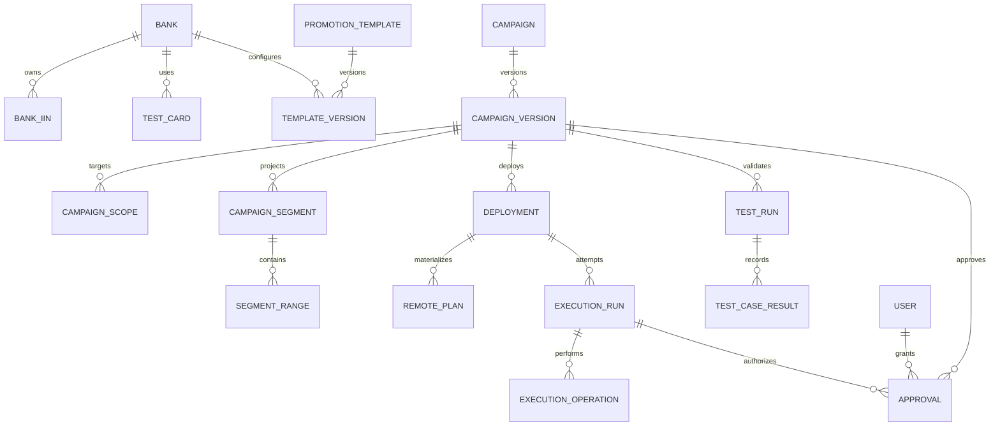

# 06. Modelo de datos con PostgreSQL y Prisma

## 1. Objetivos

- Representar intención comercial y planes remotos por separado.
- Versionar todo dato que afecte ejecución.
- Conservar IDs futuros invisibles para `get all`.
- Relacionar sandbox y producción sin compartir IDs.
- Auditar cada transición.
- Permitir consultas temporales y calendario.

## 2. Diagrama conceptual

## 3. Catálogo

### `Bank`

- `id`
- `code` único
- `name`
- `description`
- `status`: `ACTIVE | INACTIVE | ARCHIVED`
- `createdAt`, `updatedAt`

General y Amex pueden modelarse como scopes especiales; Amex puede tener una entidad de catálogo propia si facilita BINs y tarjetas.

### `BankIin`

- `id`
- `bankId`
- `value` normalizado
- `activeFrom`, `activeTo`
- `status`
- auditoría de alta/baja

Restricción: un BIN activo pertenece a un único banco.

### `TestCard`

- `id`
- `bankId` opcional para General
- `label`
- `numberEncrypted` o tratamiento definido para datos de prueba
- `iin`
- `active`

Aunque sean tarjetas de QA, la UI evitará exposición innecesaria y distinguirá claramente datos de prueba.

### `PromotionTemplate` y `TemplateVersion`

La entidad estable contiene nombre, tipo, estado y referencia a versión actual. Cada versión contiene el snapshot de:

- scope/nivel;
- cuatro rangos o estructura especial;
- cuotas por rango;
- BINs referenciados o estrategia de resolución;
- naming defaults;
- reglas configurables.

Desactivar una plantilla no modifica versiones consumidas.

## 4. Campañas

### `Campaign`

- `id`
- `name`
- `description`
- `createdById`
- `currentVersionId`
- timestamps

El estado operativo mostrado para una campaña se deriva de sus versiones, deployments y runs; no se persiste como una máquina de estados única.

### `CampaignVersion`

- `id`
- `campaignId`
- `versionNumber`
- `canonicalHash`
- `status`: `DRAFT | VALIDATED | SUPERSEDED`
- `sourceTemplateVersionId` nullable
- `changeReason`
- `configurationSnapshot` JSON tipado/validado
- `createdById`
- `createdAt`
- `supersededAt`

Una versión probada no se edita.

### `CampaignScope`

- tipo: `GENERAL | BANK | SPECIFIC_DAY | RESTRICTION`
- `bankId` cuando corresponda
- `priorityLevel`
- BIN snapshot

### `CampaignSegment`

- `id`
- `campaignVersionId`
- `sequence`
- `logicalStartAt`
- `logicalFinishAt`
- `phase`: `BEFORE | DURING | AFTER | TRANSITION`
- `effectiveConfigurationHash`

### `SegmentRange`

- `segmentId`
- `rangeIndex`
- `minValue`, `maxValue` como decimal
- moneda ARS
- `installments` JSON estructurado o relación hija
- payload lógico derivado

Los montos no deben almacenarse como float.

## 5. Despliegues y planes remotos

### `Deployment`

- `id`
- `campaignVersionId`
- `environment`: `SANDBOX | PRODUCTION`
- `kind`: `CANONICAL | TEST`
- `status`
- `configurationHash`
- `baseSnapshotHash`
- `scheduledAt`
- `createdById`

### `RemotePlan`

- `id` local
- `deploymentId` nullable mientras un plan importado se clasifica
- `environment`
- `yunoPlanId`
- `segmentId` nullable mientras un plan importado se clasifica
- `rangeIndex`
- `name`
- `requestSnapshot`
- `responseSnapshot`
- `remoteCreatedAt`, `remoteUpdatedAt`
- `startAt`, `finishAt`
- `status`
- `deletedAt`, `deleteReason`
- `replacesRemotePlanId` nullable
- `equivalentLogicalKey`
- `origin`: `TOOL | IMPORTED`
- `importStatus`: `PENDING | CLASSIFIED | ANOMALY`
- `importNotes` JSON/texto nullable

`yunoPlanId + environment` debe ser único. El vínculo lógico permite relacionar sandbox y producción.

## 6. Ejecuciones

### `ExecutionRun`

- `id`
- `deploymentId`
- `status`
- `idempotencyKey`
- `planHash`
- `baseSnapshotHash`
- `approvedPlanHash` nullable hasta recibir aprobación
- `lockKey`
- `queuedAt`
- `claimedAt`
- `leaseOwner` nullable
- `leaseExpiresAt` nullable
- `nextAttemptAt` nullable
- `startedAt`, `finishedAt`
- `heartbeatAt`
- `requestedById`
- `failureClassification`
- `lastConfirmedOperation`

`ExecutionRun` junto con sus `ExecutionOperation` constituye el `ExecutionPlan` persistido. El `planHash` cubre el baseline, operaciones ordenadas, IDs afectados, payloads esperados y versión de reglas. Si cambia cualquiera de esos datos se crea otro run y la aprobación anterior no es reutilizable.

### `ExecutionOperation`

- `id`
- `runId`
- `sequence`
- `type`: `CREATE | UPDATE | DELETE | VERIFY | COMPENSATE_CREATE | COMPENSATE_UPDATE | COMPENSATE_DELETE`
- `targetRemotePlanId`
- `requestSnapshot`
- `responseSnapshot`
- `status`
- `attemptCount`
- `startedAt`, `finishedAt`
- `errorCode`, `errorMessage`
- `resultCertainty`: `CONFIRMED | FAILED | UNKNOWN`
- `compensationOperationId`

## 7. Pruebas y aprobaciones

### `TestRun`

- `campaignVersionId`
- `environment`, forzado a sandbox
- `logicalCheckpoint`
- `dateShiftSeconds`
- `status`
- `temporaryDeploymentId`
- `startedById`, timestamps
- `cleanupStatus`

### `TestCaseResult`

- fase/segmento
- banco/tarjeta/BIN
- monto
- cuotas esperadas
- cuotas observadas
- resultado: `PASSED | FAILED | NOT_APPLICABLE`
- justificación
- `testedById`, `testedAt`

### `Approval`

- `campaignVersionId`
- `executionRunId`
- `planHash`
- `type`: validación comercial, sandbox, producción
- `decision`
- `checklistSnapshot`
- `warningsAccepted`
- `decidedById`, `decidedAt`
- `revokedAt`, `revocationReason`

## 8. Identidad y permisos

- `User` con `role: VIEWER | OPERATOR | ADMIN`
- `User.status: ACTIVE | DISABLED`
- sesiones/identidades externas según proveedor elegido

No habrá tablas configurables de roles o permisos en la primera versión. Las políticas se implementan en una frontera server-side centralizada.

Los eventos de autorización denegada también pueden auditarse cuando sean sensibles.

## 9. Auditoría

`AuditEvent` será append-only desde la aplicación:

- actor;
- acción;
- entidad y ID;
- ambiente;
- before/after redactados;
- correlation/run ID;
- timestamp;
- metadata.

No reemplaza las tablas operativas; las complementa.

## 10. Reglas de persistencia

- Soft delete/archivo para catálogo referenciado.
- Nunca borrar físicamente campañas, versiones, runs, operaciones, pruebas o aprobaciones desde la UI.
- Transacción local para crear run y operaciones antes de encolar.
- Índices por ambiente, estado, vigencia, banco y campaign version.
- Índice de queue por `status + nextAttemptAt + queuedAt` para reclamar runs pendientes.
- Reclamo atómico de un run; dos workers nunca pueden poseer el mismo lease vigente.
- Validaciones de solapamiento en dominio y, cuando sea viable, restricciones adicionales de base.
- Prisma migrations versionadas; cualquier SQL complementario también vive en el repositorio.
