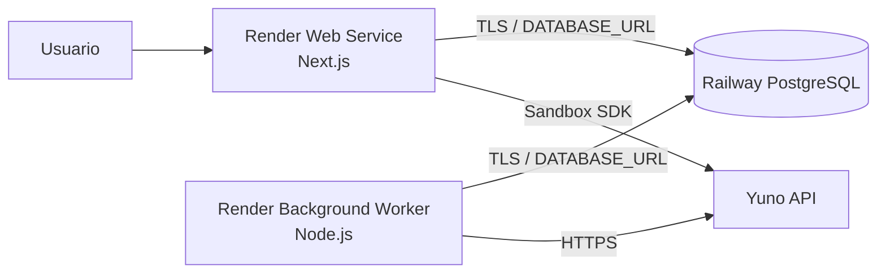

# 15. Topología de despliegue Render + Railway

## 1. Decisión

La infraestructura inicial utilizará únicamente proveedores ya adoptados por el equipo:

- **Render Web Service:** aplicación Next.js, UI y BFF.
- **Render Background Worker:** ejecución durable de campañas.
- **Railway PostgreSQL:** fuente de verdad, queue, auditoría y locks.

No se utilizarán Render Postgres, Render Key Value, Render Workflows, Redis ni brokers externos.



## 2. Servicios Render

### Web

Responsabilidades:

- servir Next.js;
- autenticación y autorización;
- consultas y comandos de aplicación;
- crear `ExecutionRun`/operaciones en PostgreSQL;
- mostrar progreso mediante polling;
- integrar el laboratorio SDK.

No ejecuta campañas completas dentro de requests HTTP.

### Worker

Responsabilidades:

- hacer polling de PostgreSQL;
- reclamar runs mediante lease;
- ejecutar operaciones Yuno secuenciales;
- guardar resultados y heartbeats;
- ejecutar compensaciones;
- clasificar estados inciertos;
- limpiar ensayos SDK.

Inicialmente tendrá una sola instancia.

### Repositorio compartido

Ambos servicios se despliegan desde el mismo repositorio y commit. Usarán comandos diferentes, por ejemplo:

```text
Web:    npm run start
Worker: npm run worker
```

Los comandos definitivos se crearán con el proyecto. El dominio, Prisma, adapter Yuno, configuración y logging se comparten; no habrá dos codebases.

## 3. PostgreSQL en Railway

Railway alojará:

- datos funcionales;
- campañas/versiones;
- IDs remotos;
- queue PostgreSQL;
- operaciones;
- pruebas/aprobaciones;
- auditoría.

El template Railway PostgreSQL requiere responsabilidad operativa explícita. Para producción se exige:

- volumen persistente;
- backups automáticos configurados;
- Point-in-Time Recovery habilitado si el plan lo permite;
- alerta de uso de disco;
- prueba periódica de restore;
- versión mayor de PostgreSQL fijada y actualizaciones planificadas;
- credenciales rotables.

## 4. Conexión cross-cloud

Render no puede usar la red privada de Railway. Web y worker se conectarán mediante la URL externa/TCP proxy de Railway.

Requisitos:

- TLS obligatorio.
- Railway publica la conexión externa como `DATABASE_PUBLIC_URL`; su valor se configura en Render con el nombre `DATABASE_URL`, sin hardcodear host o IP.
- Guardar la URL como secreto independiente en cada servicio Render.
- Pool de conexiones acotado por servicio/instancia.
- Timeout de conexión y query.
- Retry limitado solo para errores transitorios seguros.
- Métricas de latencia y fallos de conexión.
- Rotación coordinada de credenciales.
- Evaluar restricción de acceso por red/IP si los planes y capacidades de ambos proveedores lo permiten.

La URL externa genera tráfico cross-cloud y puede implicar egress de Railway; deberá monitorearse.

## 5. Regiones

La combinación recomendada es:

- Railway: `US East` (Virginia).
- Render: `Virginia`.

Ambos proveedores ubican esas regiones en Virginia, aunque la conexión sigue siendo pública. Si la base Railway ya existe en otra región, se medirá latencia y se elegirá la región Render más cercana antes de crear los servicios, porque cambiar una región después puede requerir recreación/migración.

## 6. Prisma y conexiones

- Prisma usa PostgreSQL mediante TLS.
- Web y worker tienen pools separados.
- El pool inicial será pequeño porque habrá una instancia de cada servicio.
- Los jobs no mantendrán transacciones abiertas durante llamadas a Yuno.
- El claim del run usa una transacción breve; luego cada paso persiste su propio estado.
- Las migraciones se ejecutan una sola vez por despliegue, nunca simultáneamente desde web y worker.

## 7. Despliegue y migraciones

Secuencia propuesta:

1. CI ejecuta lint, typecheck, tests y build para un commit SHA.
2. Se crea backup/restore point antes de migraciones riesgosas.
3. Un único comando autorizado ejecuta `prisma migrate deploy` contra Railway.
4. Render despliega el Web Service para ese SHA.
5. Render despliega/reinicia el Background Worker para el mismo SHA.
6. El worker anterior recibe señal de apagado, deja de reclamar runs y libera/expira su lease de forma segura.
7. Smoke tests confirman web, DB y worker.

Las migraciones deben ser compatibles con despliegues graduales. Cambios destructivos usan estrategia expand/migrate/contract. Los auto-deploys independientes no se consideran coordinación suficiente: el procedimiento verifica el SHA activo de ambos servicios.

## 8. Configuración como código

Se incorporará `render.yaml` o configuración equivalente para:

- Web Service.
- Background Worker.
- región.
- comandos de build/start.
- health check web.
- variables no secretas.

Railway mantiene su configuración de PostgreSQL en su proyecto. La documentación del repositorio incluirá nombre de variables, región, backup policy y procedimiento de conexión, pero nunca valores secretos.

## 9. Variables por servicio

### Compartidas

- `DATABASE_URL`
- configuración de autenticación necesaria
- identificador de ambiente de aplicación
- parámetros de logging/observabilidad

### Web

- secretos de sesión/auth
- configuración pública y privada del SDK sandbox
- parámetros de UI

### Worker

- credenciales Yuno sandbox
- credenciales Yuno producción
- account IDs/configuración Argentina
- polling interval
- lease/heartbeat settings

Se evaluará si el Web Service necesita credenciales Yuno de lectura. Las credenciales de escritura deben quedar limitadas al worker cuando el contrato de Yuno permita separar capacidades.

## 10. Salud y observabilidad

### Web

- endpoint de health sin secretos;
- verificación superficial de proceso;
- endpoint interno/autorizado para salud DB detallada.

### Worker

- heartbeat persistido en PostgreSQL;
- alerta si no actualiza;
- último run y última operación;
- logs estructurados con correlation ID.

### Base

- conexiones activas;
- latencia;
- CPU/memoria;
- uso de volumen;
- estado de backups/PITR;
- fallos de restore test.

## 11. Ambientes de infraestructura

### Local

- Next.js local.
- worker local.
- PostgreSQL remota exclusiva de pruebas mediante `DATABASE_URL`.
- Yuno sandbox únicamente.
- Docker no es requisito del desarrollo.

### Staging

- servicios Render separados o ambiente de staging.
- base Railway separada.
- solo credenciales Yuno sandbox.
- pruebas de migración y ejecutor.

### Production

- Web y worker Render productivos.
- base Railway productiva.
- credenciales Yuno sandbox y producción según capacidades contratadas.
- gates productivos habilitados.

Staging nunca debe poseer credenciales Yuno de producción.

## 12. Recuperación

### Caída de Web

El worker puede continuar porque consulta PostgreSQL directamente. La UI recupera estado cuando vuelve.

### Caída de Worker

El run conserva sus operaciones. Al reiniciar, el worker detecta lease vencido y retoma o envía a reconciliación.

### Caída de Railway PostgreSQL

Web y worker dejan de iniciar nuevas escrituras. No se llama a Yuno sin poder persistir el resultado. Tras recuperar DB se revisan runs que estaban activos.

### Deploy durante ejecución

El worker deja de reclamar nuevos runs, intenta completar/persistir el paso actual y finaliza. Si es terminado, el lease permite recuperación.

## 13. Criterios de aceptación de infraestructura

- Web y worker se despliegan desde el mismo commit.
- Ambos conectan a Railway con TLS.
- La latencia DB está medida y dentro del umbral acordado.
- Un reinicio de worker no duplica un paso confirmado.
- Una caída de DB impide nuevas llamadas Yuno.
- Migraciones se ejecutan una sola vez.
- Backup automático y PITR están configurados.
- Se realizó al menos un restore de prueba antes de producción.
- Staging no contiene credenciales Yuno productivas.
- Ningún secreto aparece en repositorio o logs.
